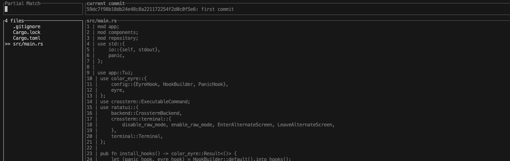

# gview - A TUI Viewer for Specific Git Commit IDs



gview is a TUI application that lets you inspect files or search for files by traversing Git commit IDs.

Currently, gview displays the repository located in the user's current working directory.

Please note that this application is a personal hobby project and is not in a finished state. It works reliably for medium-sized repositories with a few hundred commits. However, performance may degrade when working with large repositories containing tens of thousands of commits.

# install

```bash
cargo install gview
```

# default keymap

## Global Keys
| Key | Description |
| --- | ----------- |
| <kbd>?</kbd> | Show help modal with all key bindings |
| <kbd>Tab</kbd> | Switch focus between panels |
| <kbd>Ctrl+C</kbd> | Exit gview |
| <kbd><</kbd> | Decrease left panel width |
| <kbd>></kbd> | Increase left panel width |
| <kbd>ESC</kbd> | Close help modal (when open) |

## Filter Panel
| Key | Description |
| --- | ----------- |
| <kbd>Enter</kbd> | Apply filter |
| <kbd>Ctrl+A</kbd> | Select all text |

## File List Panel
| Key | Description |
| --- | ----------- |
| <kbd>↑</kbd>, <kbd>↓</kbd>, <kbd>j</kbd>, <kbd>k</kbd> | Navigate through files |
| <kbd>Enter</kbd> | Select file |

## Commit Panel
| Key | Description |
| --- | ----------- |
| <kbd>o</kbd> | Open commit modal |

## Content Viewer
| Key | Description |
| --- | ----------- |
| <kbd>↑</kbd>, <kbd>↓</kbd>, <kbd>j</kbd>, <kbd>k</kbd> | Scroll content vertically |
| <kbd>←</kbd>, <kbd>→</kbd>, <kbd>h</kbd>, <kbd>l</kbd> | Scroll content horizontally |
| <kbd>b</kbd> | Toggle blame view |
| <kbd>n</kbd> | Toggle line numbers |
| <kbd>g</kbd> | Open current file in browser at current commit and line |

## Help Modal

Press <kbd>?</kbd> at any time to open an interactive help modal that displays all available key bindings. The help modal:

- Shows context-sensitive help organized by panel
- Works in any terminal size (responsive design)
- Features a clean double-line border design
- Can be closed by pressing <kbd>ESC</kbd>

This makes it easy to learn and remember all the keyboard shortcuts without leaving the application.

## Browser Integration

When viewing a file, press <kbd>g</kbd> to open the current file in your web browser. This feature:

- Opens the file at the exact commit ID you're viewing in gview
- Highlights the line that's currently at the top of your view
- Works with GitHub, GitHub Enterprise, and other Git hosting services
- Supports both SSH and HTTPS remote URLs
- Works cross-platform (macOS, Linux, Windows)

**Example**: If you're viewing `src/main.rs` at commit `abc123f` with line 42 at the top of the screen, pressing <kbd>g</kbd> will open:
```
https://github.com/owner/repo/blob/abc123f/src/main.rs#L42
```

# contribution

Contributions are always welcome! Please note that responses may not be immediate, as this is maintained on a best-effort basis.
There are still several implementation tasks that would improve usability and are relatively easy to tackle. Check the Issues page for more details.


# LICENSE
This project is licensed under the MIT License.